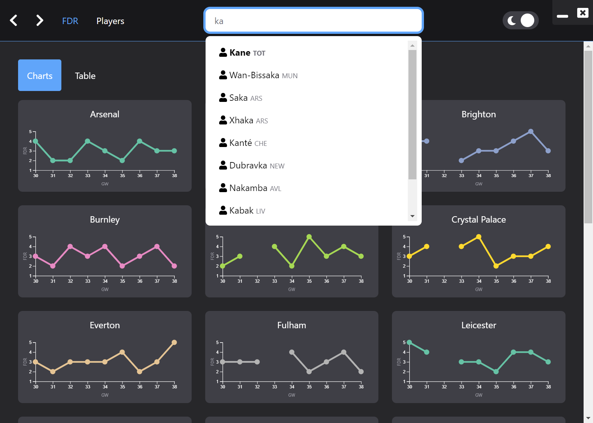
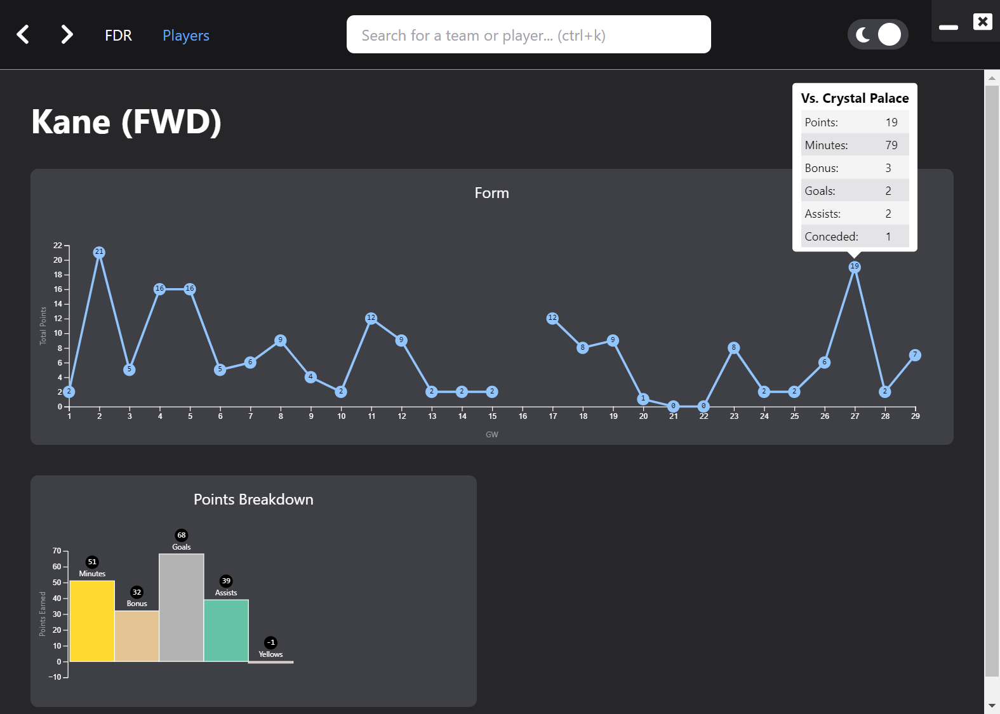

# FPL

Just a small Vue.JS Electron app I've been making in my spare time that plots FPL data into D3 charts.

**Still a work in progress.**






## Project setup

```bash
yarn install
```

### Compiles and hot-reloads for development

```bash
yarn serve
```

### Compiles and minifies for production

```bash
yarn build
```

### Lints and fixes files

```bash
yarn lint
```

### Customize configuration

See [Configuration Reference](https://cli.vuejs.org/config/).
